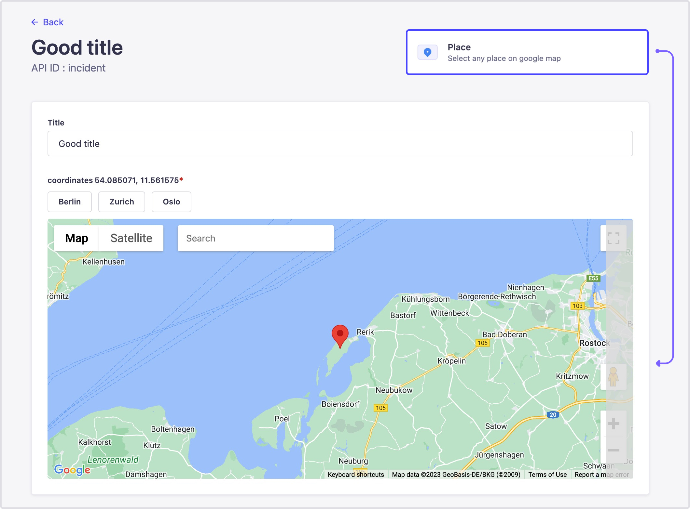
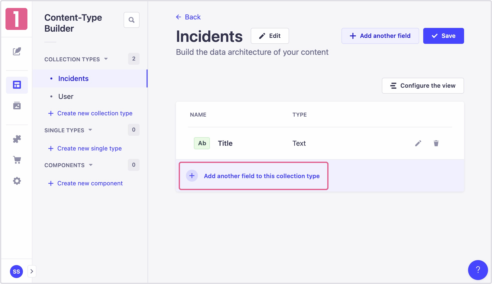

<div align="center">
  
</div>
<div align="center">
  <h1>Strapi v4 - google map picker</h1>
  <p>A simple plugin to add a point to the map, with the <a href="https://github.com/JustFly1984/react-google-maps-api">@react-google-maps/api
</a> package</p>
</div>



---

## 🗿 How to install

```javascript
# yarn
yarn add strapi-plugin-google-map-picker

# npm
npm i strapi-plugin-google-map-picker
```

## 🔧 Configuration

#### 1. Add plugin in plugins.js
```javascript
// config/plugins.js
...
...
"google-map-picker": {
    config: {
    apiKey: env("GOOGLE_PUBLIC_KEY"), // required
    default_center: { lat: 54.106438, lng: 11.556940 }, // required
    favorites_places: [
        {
        title: "Berlin",
        coordinates: { lat: 52.518536, lng: 52.518536 },
        },
        {
        title: "Zurich",
        coordinates: { lat: 47.384168, lng: 8.526831 },
        },
        {
        title: "Oslo",
        coordinates: { lat: 59.911002, lng: 10.756167},
        },
    ],
    },
},
...
...
```
#### 2. Add "strapi::security" in middlewares.js
```javascript
// config/middlewares.ts
...
...
'strapi::errors',
{
  name: "strapi::security",
  config: {
  contentSecurityPolicy: {
    directives: {
      "script-src": ["'self'", "maps.googleapis.com", "maps.gstatic.com"],
      "img-src": ["'self'", "data:", "maps.googleapis.com", "maps.gstatic.com"],
    },
  },
  },
},
'strapi::cors',
...
...
```

#### 3. Add custom field




